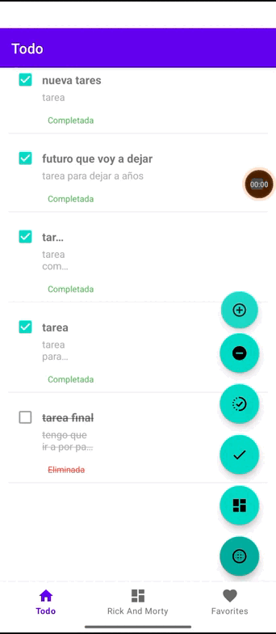
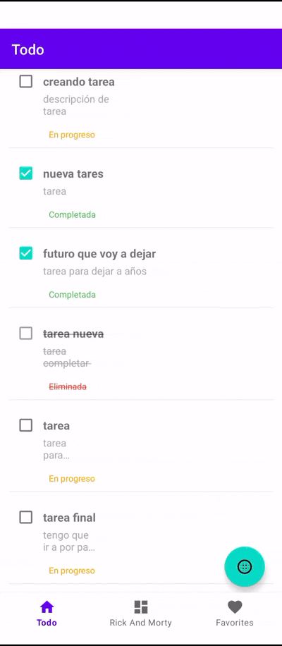
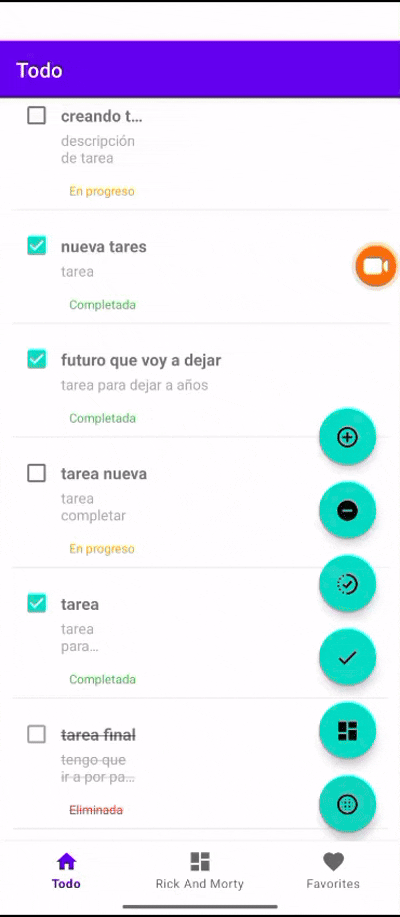

# todolist_rickandmortyAPI
Project Todo List app  + Rick and Morty API


## Índice
1. [Diseño UI/UX](#diseño-uiux)
2. [Estructura del Proyecto](#estructura-del-proyecto)
2. [Arquitectura](#arquitectura)
3. [Componentes Clave](#componentes-clave)
5. [Pruebas](#pruebas)
6. [Librerías Utilizadas](#librerías-utilizadas)
7. [Mejoras Futuras](#mejoras-futuras)


# Diseño UI/UX

## Justificación de diseño 
El diseño de esta parte de la app está inspirada en la serie, es algo irregular, los holders están algo descuadrados, tiene animaciones y un meme del propio Morty para contextualizar la serie en la app, así como hacerla divertida y fácil de usar.

## Pantalla de Personajes (Rick y Morty)


### Características:

- Listado paginado

- Sistema de favoritos

- Animación al cambiar estado de favorito

## Arquitectura y Componentes
El módulo Rick and Morty sigue un patrón MVVM (Model-View-ViewModel) con los siguientes componentes principales:

1. ViewModel (RickAndMortyViewModel)

   - estiona la lógica de negocio

   - Se comunica con el repositorio y la API

   - Expone datos observables a la UI
   

2. Repositorio (RickAndMortyRepository)

   - Abstraction layer para acceder a datos

   - Combina fuentes de datos locales (Room) y remotas (API)

3. API Service (RickAndMortyApi)

   - Interfaz Retrofit para consumir la API pública

## Flujo de Datos
~~~
sequenceDiagram
UI->>ViewModel: fetchCharacters()
ViewModel->>Repository: Obtener personajes (cache/API)
alt Datos en cache
Repository-->>ViewModel: Datos locales
else Sin cache
Repository->>API: Llamada HTTP GET
API-->>Repository: Response JSON
Repository->>DB: Guardar datos
end
ViewModel-->>UI: Actualizar LiveData
~~~
## Características Clave
1. Paginación

   - Uso de variable currentPage para controlar la paginación

   - Bandera isLoading para evitar llamadas duplicadas

   - Carga incremental al hacer scroll


2. Gestión de Favoritos

   - Toggle de estado con toggleFavorite()

   - Actualización inmediata de UI y base de datos local

   - Persistencia de estado entre sesiones


3. Caching

    - Doble fuente de datos (API + Room)

   - Primero se comprueba cache antes de llamar a la API

## Ejemplo de Uso
~~~
// Inicialización
val repository = RickAndMortyRepository(database)
val viewModel = RickAndMortyViewModel(repository)

// Observar cambios
viewModel.characters.observe(this) { characters ->
    adapter.submitList(characters)
}

// Cargar más personajes (paginación)
recyclerView.addOnScrollListener(object : OnScrollListener() {
override fun onScrolled(recyclerView: RecyclerView, dx: Int, dy: Int) {
    if (!recyclerView.canScrollVertically(1)) {
        viewModel.fetchCharacters()
}
}
})

// Manejar favoritos
adapter.onFavoriteClick = { character ->
    viewModel.toggleFavorite(character)
}
~~~

## Pantalla de Tareas (TODO)
## Justificación de diseño
Esta parte de la app, es más cuadrícula y ordenada para reflejar algo de control y cierta formalidad pero con un menú moderno y unos colores suaves para reflejar que el usuario es joven y le gusta la tecnología.
Interacciones:


### Crear tarea


## Operaciones sobre recycler

### Checkear y borrar una tarea


### Filtrar por estado

#### Filtrar por check

#### Fitrar por in progress

#### Filtrar por delete


## Arquitectura y Componentes
### ViewModel (TodoFragmentViewModel)

- Expone flows para diferentes estados de tareas

- Proporciona métodos para operaciones CRUD

### Repositorio (TodoRepository)

- Acceso a la base de datos local (Room)

- Maneja operaciones asíncronas

### Modelo (TodoModel)

- Estructura de datos para tareas

- Estados definidos en enum TaskState

## Flujo de Datos
~~~
sequenceDiagram
UI->>ViewModel: getCompletedTasks()
ViewModel->>Repository: Solicitar tareas completadas
Repository->>Database: Query con filtro state=COMPLETED
Database-->>Repository: List<TodoModel>
Repository-->>ViewModel: Flow<List<TodoModel>>
ViewModel-->>UI: Actualizar UI
~~~

## Características Clave
### Gestión de Estados

- Tres estados posibles: COMPLETED, IN_PROGRESS, DELETED

- Métodos específicos para cada estado (getCompletedTasks(), etc.)

### Operaciones CRUD

- Actualización de estado con updateTask()

- Filtrado reactivo usando Flows

### Patrón Observer

- UI reacciona a cambios en los Flows

- Actualización automática cuando cambian los datos

### Ejemplo de Uso
~~~
// Inicialización
val viewModel: TodoFragmentViewModel by viewModels()

// Observar todas las tareas
viewModel.allTasks.onEach { tasks ->
// Actualizar RecyclerView
}.launchIn(lifecycleScope)

// Filtrar tareas completadas
viewModel.getCompletedTasks().onEach { completedTasks ->
// Mostrar solo tareas completadas
}.launchIn(lifecycleScope)

// Actualizar una tarea
fun onTaskChecked(task: TodoModel) {
task.state = TaskState.COMPLETED.name
viewModel.updateTask(task)
}

// Manejar eliminación
fun onTaskDeleted(task: TodoModel) {
task.state = TaskState.DELETED.name
viewModel.updateTask(task)
}
~~~

## Comparativa de Módulos
| Característica|               	Rick and Morty Module               |	Todo Module|
|:---------------:|:--------------------------------------------------:|:--------:|
|Fuente de datos	|            API + Cache local	|Solo local            
|Patrón observación	|                   LiveData	Flow                    
|Paginación	|                         Sí                         |	No|
|Estados	| Favorito/No favorito	|COMPLETED/IN_PROGRESS/DELETED 
|Actualizaciones|                	Inmediatas (toggle)                |    	Transaccionales     |
|Animaciones	|                   Sí (favoritos)                   |                 	Sí (transiciones)                 |


## Estructura del Proyecto

~~~
myapplication/
├── data/
│ ├── api/ # Interfaces de API y modelos de red
│ ├── local/ # Base de datos local (Room)
│ │ ├── dao/ # Data Access Objects
│ │ ├── models/ # Entidades y modelos locales
│ │ └── room/ # Configuración de la base de datos
│ └── repository/ # Repositorios que unen fuentes de datos
├── ui/
│ ├── common/ # Componentes reutilizables
│ │ ├── adapter/ # Adaptadores para RecyclerView
│ │ ├── diff/ # Utilidades DiffUtil
│ │ └── holder/ # ViewHolders
│ └── feactures/ # Funcionalidades específicas
│ ├── rickAndMorty/ # Personajes de Rick y Morty
│ └── todo/ # Gestión de tareas
└── utils/ # Utilidades y constantes
~~~


## Arquitectura
Se implementó Clean Architecture simplificada:
- **Data Layer**: Maneja fuentes de datos (API y base de datos local)
- **Domain Layer**: (Simplificado) Lógica de negocio en ViewModels
- **UI Layer**: Presentación y componentes visuales

*Nota*: Se omitieron UseCases por simplicidad, pero la estructura permite su fácil implementación.

## Componentes Clave
### 1. Manejo de API (RickAndMorty)
~~~

interface RickAndMortyApi {
    @GET("character")
    suspend fun getCharacters(@Query("page") page: Int): RickAndMortyResponse
}
~~~


### 2. Base de Datos Local (Room)

~~~

@Database(entities = [RickAndMortyEntity::class], version = 1)
abstract class RickAndMortyBase : RoomDatabase() {
    abstract fun rickAndMortyDAO(): RickAndMortyDAO
}
~~~

# Tests

## RickAndMortyDiffCallbackTest
~~~
class RickAndMortyDiffCallbackTest {
    @Test
    fun `areItemsTheSame returns true when ids match`() {
        // Configuración y verificación de igualdad de items por ID
    }
    
    @Test
    fun `areItemsTheSame returns false when ids differ`() {
        // Verificación de diferencia de items por ID
    }
    
    @Test
    fun `areContentsTheSame returns true when all fields match`() {
        // Verificación de igualdad de contenido cuando todos los campos coinciden
    }
    
    @Test
    fun `areContentsTheSame returns false when any field differs`() {
        // Verificación de diferencia de contenido cuando algún campo cambia
    }
}
~~~

Propósito: Verificar el comportamiento correcto del callback DiffUtil para el RecyclerView de personajes de Rick y Morty.

### Casos probados:

- Identificación de items iguales: Confirma que dos items se consideran el mismo cuando comparten ID, aunque otros campos difieran.

- Identificación de items diferentes: Verifica que items con IDs distintos se consideran diferentes.

- Comparación de contenido idéntico: Confirma que items con todos los campos iguales se consideran idénticos en contenido.

- Detección de cambios en contenido: Verifica que cualquier cambio en los campos (como el nombre) sea detectado.

Importancia: Estas pruebas garantizan que el RecyclerView actualizará eficientemente solo los items que hayan cambiado, mejorando el rendimiento de la UI.


## Pruebas de Instrumentación (UI)
### TodoViewHolderEspressoTest
~~~
@RunWith(AndroidJUnit4::class)
class TodoViewHolderEspressoTest {
    @get:Rule
    val activityRule = ActivityScenarioRule(MainActivity::class.java)

    @Test
    fun checkboxClick_shouldUpdateState() {
        // Simula click en checkbox y verifica cambio de estado
        onView(withId(R.id.checkBox)).perform(click())
        onView(withId(R.id.stateText)).check(matches(withText("Completada")))
    }
}
~~~

#### Propósito: Verificar el comportamiento de la UI para el ViewHolder de tareas.

##### Características:

- Usa Espresso para pruebas de UI

- Configura un escenario de actividad real

- Infla la vista del ViewHolder y realiza interacciones

#### Caso probado:

Cambio de estado al hacer click: Verifica que al hacer click en el checkbox, el texto de estado cambia a "Completada".

#### Configuración especial:

- Infla el layout del ViewHolder

- Crea una tarea de prueba

- Realiza el binding con el ViewHolder

- Establece el contenido de la actividad para las pruebas

- Estrategia de Pruebas
- Cobertura Actual

## Pruebas de Integración con Room Database

### Propósito
Verificar el correcto funcionamiento del DAO (Data Access Object) para la entidad TodoModel, incluyendo operaciones CRUD básicas y consultas específicas.

### Configuración de Pruebas
~~~
@Before
fun setup() {
    database = Room.inMemoryDatabaseBuilder(
        ApplicationProvider.getApplicationContext(),
        TodoDatabase::class.java
    ).allowMainThreadQueries().build()
    todoDao = database.todoTaskDao()
}
~~~

#### Características clave:

- Uso de base de datos en memoria para pruebas aisladas

- Permite ejecutar queries en el hilo principal (solo para testing)

- Se recrea antes de cada test para garantizar independencia

- Casos de Prueba Implementados
### 1. Inserción de Tareas
~~~
@Test
fun insertTask_shouldInsertTask() = runBlocking {
    val task = TodoModel(
        title = "Test Task",
        description = "Test Description",
        state = "in progress",
        date = "2023-01-01"
    )
    // ... implementación
}
~~~

### Verificaciones:

- La tarea se inserta correctamente en la base de datos

- El conteo de items aumenta a 1

- Los campos se mantienen intactos después de la inserción

### 2. Actualización de Tareas

~~~
@Test
fun updateTask_shouldUpdateTask() = runBlocking {
    val insertedTask = todoDao.getAllTasks().first()[0]
    val updatedTask = insertedTask.copy(title = "Updated Task")
    // ... implementación
}
~~~

#### Comportamiento esperado:

- Los cambios en los campos se persisten correctamente

- Solo se modifica el campo especificado (title)

- El ID permanece constante durante la actualización

#### 3. Eliminación de Tareas
~~~
@Test
fun deleteTask_shouldDeleteTask() = runBlocking {
    todoDao.deleteTask(insertedTask)
    val allTasks = todoDao.getAllTasks().first()
    assertTrue(allTasks.isEmpty())
}
~~~
#### Validaciones:

- La tarea se elimina completamente de la base de datos

- La consulta posterior retorna lista vacía

- No quedan referencias residuales

### 4. Búsqueda por ID

~~~
@Test
fun getTaskById_shouldReturnCorrectTask() = runBlocking {
    val retrievedTask = todoDao.getTaskById(task2!!.id)
    assertEquals("Task 2", retrievedTask?.title)
}
~~~
### Casos cubiertos:

- Recuperación exacta por identificador único

- Integridad de los datos recuperados

- Manejo correcto de múltiples registros

#### Estructura de la Prueba
```
sequenceDiagram
    Test->>+DAO: insertTask()
    DAO->>+DB: Insert row
    Test->>+DAO: getAllTasks()
    DAO->>+Test: Return Flow<List>
    Test->>Assertions: Verify results
```

## Tecnologías Utilizadas

|Tecnologías| Utilizadas|
|:-------: |:--------:|
|Componente|	Función|
|Room Testing|	Base de datos en memoria|
|JUnit	Framework| de pruebas|
|Coroutines|	Manejo de operaciones asíncronas|
|InstantTaskExecutorRule| Para pruebas sincrónicas|

# Librerías Utilizadas

|Librería  | Propósito|
|:-------: |:--------:|
|Retrofit  |	Consumo de APIs REST|
|Room	   | Persistencia local|
|Coroutines|	Programación asíncrona|

# Mejoras Futuras
Implementar inyección de dependencias

Añadir más pruebas de UI

Añadir dark mode

Añadir notificaciones


